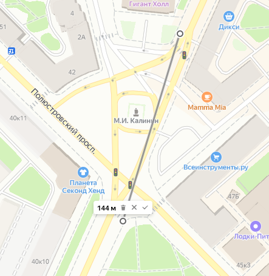

# Главная дорога: Write-up

В этом задании нам необходимо найти светофор с довольно примечательным [дорожным знаком](app/static/IMG_20220407_130738.jpg) на столбе.

Давайте сначала сузим географию поиска. То, что страна — Россия — довольно очевидно по знаку «СТОП» и рекламе на фоне на русском языке. Та же реклама нам поможет определить город: сеть «Токио City» есть в четырёх городах России: Санкт-Петербурге, Москве, Петрозаводске и Великом Новгороде.

Если зайти, например, в панорамные снимки этих городов и посмотреть на столбы светофоров, из этих вариантов останется только Петербург — его выдают характерные зелёные таблички ПетербургГаза.

*Фотография: https://22sobaki.livejournal.com/*

Загрузим фотографию в [поиск по картинкам Яндекса](https://yandex.ru/images/). В результатах мы видим довольно много различных дорожных знаков. Большинство из них — что-то совсем не похожее, но на нескольких фотографиях явно запечатлён нужный перекрёсток.

Ссылки на страницы возвращают некие сайты по парсингу ВК — к сожалению, даже если перейти на оригинальные страницы, ничего полезного мы не найдём.

Давайте посмотрим, какие ещё ракурсы у нас есть. Например, наше внимание могла привлечь вот эта фотография:

*Фотография: https://vk.com/timadob*

К сожалению, сайт, где она была размещена, уже не работает — при открытии ссылки выдаётся 404. Здесь было два пути для дальнейшего продвижения.

Первый путь — ориентируясь на имя автора «Тимофей Добродумов, Санкт-Петербург» и на ссылку к изображению на домене `userapi.com` (это домен ВКонтакте), пойти и поискать такого Тимофея ВКонтакте. У него в фотографиях находим это же изображение, а в комментариях — ответ на вопрос, где же это — «Кондратьевская площадь».

Второй путь — увидеть на фотографии ещё одно полезное слово. Это вывеска, оканчивающаяся на «ининский». Слов с таким окончанием немного. Мне удалось найти всего два: «Калининский» и «Екатерининский». Поищем и те, и другие названия мест на картах. По слову «Екатерининский» находится дворец и ТЦ в Екатеринбурге. А вот по слову «Калининский» мы находим точно такую же вывеску на здании точно такого же цвета точно такой же этажности по адресу Кондратьевский проспект, 40.

Был и путь третий: обрезать фото до знака перед загрузкой. Тогда мы бы нашли другое совпадение:

*Фотография: https://vk.com/id11204438*

Там в комментариях также есть указание на локацию знака.

Теперь осталось верно ввести ответ. Находим площадь, и… видим, что на ней по меньшей мере 6 светофоров, расстояние между дальними из которых — более 100 метров. Значит, нужно искать конкретный светофор.

Посмотрев на любой знак на панорамных снимках, видим, что главная дорога (она на знаке 8.13 «Направление главной дороги») выделена толстой полосой идёт по Кондратьевскому проспекту с отклонением на перекрёстке по левой дуге.

Значит, искомый светофор найдётся при движении по проспекту с севера на юг.

Светофор около «Гигант Холла» до въезда на перекресток нам не подходит — там нижняя дорога выходит из знака перпендикулярно, а нам нужно под углом. Зато подходит следующий светофор, расположенный в точке 59.970091, 30.385727. Это и было правильным ответом.

Флаг: **ugra_unique_does_not_mean_convenient_v4qol866c05s8n8f**
