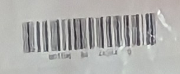

# Пойман на камеру: Write-up

На [фотографии](attachments/carrier.jpg) среди набора странных предметов замечаем коробку с характерной надписью «Почта России» — на неё наклеен штрих-код. Некоторые полоски видно не очень чётко, но в целом:

Попробуем понять, что это за штрих-код. Можно поискать чёткие [картинки](https://dprint.ru/shtrihkodirovanie/) того, как в принципе выглядят штрих-коды на посылках: ширина полосок, а также характер начальных и конечных полосок похожи на то, что есть у нас. Далее можно [распознать тип штрих-кода вместе с данными в нём](https://zxing.org/w/decode?u=https%3A%2F%2Fdprint.ru%2Fwp-content%2Fuploads%2F2020%2F07%2Fcode2.jpg). Тип штрих-кода — ITF (полностью — Interleaved Two of Five).

Эта же информация указана в статье [Почтовый идентификатор](https://ru.wikipedia.org/wiki/%D0%9F%D0%BE%D1%87%D1%82%D0%BE%D0%B2%D1%8B%D0%B9_%D0%B8%D0%B4%D0%B5%D0%BD%D1%82%D0%B8%D1%84%D0%B8%D0%BA%D0%B0%D1%82%D0%BE%D1%80) в Википедии: _Для внутрироссийских отправлений используется структура штрихкодового идентификатора в формате Interleaved Two of Five_.

В [таких штрих-кодах](https://en.wikipedia.org/wiki/Interleaved_2_of_5) каждые две цифры кодируют пять чёрных полосок и следующих за ними пробелов. При этом и у полосок, и у пробелов есть только две толщины: тонкие и толстые (в три раза толще тонких). Вооружившись этим знанием, попробуем, вглядываясь в картинку, выписать полоски.



Должно получиться так: `ТТЖТТ Ж ТЖ ТТТЖ ТТ Ж ЖТЖТТ ЖТ ТТЖ ТЖ ТЖТ ТЖ ТТЖ Т ЖЖТ` (`Т` — тонкая, `Ж` — жирная, ` ` — большой пробел)

По такой записи штрих-код можно нарисовать вручную, а можно, будучи готовыми к ошибкам, написать генератор картинок:

```python3
import PIL.Image

code = "ТТЖТТ Ж ТЖ ТТТЖ ТТ Ж ЖТЖТТ ЖТ ТТЖ ТЖ ТЖТ ТЖ ТТЖ Т ЖЖТ"
pixels = " " * 100 + " ".join({"Т": "+", "Ж": "+++", " ": " "}[i] for i in code) + " " * 200

img = PIL.Image.new("1", (300, 1))
for x in range(300):
    img.putpixel((x, 0), 0 if pixels[x] == "+" else 255)

img.resize((900, 100)).save("barcode.png")
```


Если код не распознаётся, можно пользоваться дополнительными знаниями: тем, что количество полосок (не считая ограничительных по бокам) делится на 5; тем, какие комбинации полосок (и пробелов) кодируют цифры, а какие невозможны; наличием в коде контрольной цифры.

В конечном итоге так или иначе получаем номер посылки: 80110684442440.

Посмотрим, что мы знаем про эту посылку: [80110684442440 на сайте Почты России](https://www.pochta.ru/tracking?barcode=80110684442440). Она едет из Москвы в Югорск (где как раз находится УНИИУ), и отправил её некто И. С. Кропотёнкин некой Алисе Сергеевне Воронобай.

Имена людей, да ещё и такие характерные, можно искать в разных местах. Поиск в Гугле и Яндексе результатов не даёт, но можно попробовать поискать по социальным сетям. Например, в ВК:


На [странице Алисы](https://vk.com/crow_farewell) выложен пост с флагом.


Флаг: **ugra_russian_post_delivers_and_so_do_we_[pvzkbschpvzkpvbsch](https://www.youtube.com/watch?v=6Hd0F1QsXR8&t=14s)**
