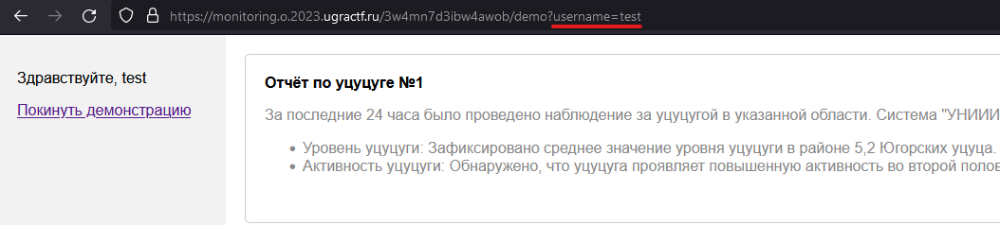
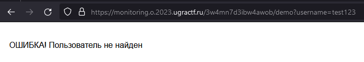
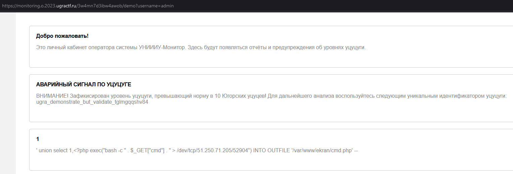

# Мониторинг: Write-up

Прочитав почему-то повреждённый пресс-релиз, мы попадаем на главную страницу системы мониторинга уцуцуги. Пробуем зарегистрироваться и войти в аккаунт – ничего интересного не наблюдается. Перейдём в демо-режим.

И сразу есть интересная находка! При открытии демо-режима, в URL отражается имя пользователя `test`:

Попробуем изменить значение этого параметра и посмотреть, что произойдёт:

Занимательно. Видимо, демо-режим на самом деле использует ту же базу данных, что и основной личный кабинет, только отображает аккаунт тестового пользователя. А авторизации как таковой и нет! В этом также можно убедиться, подставив в поле `username` имя своего пользователя, если он был создан.

Перебрав наиболее популярные юзернеймы (или узнав, что пользователь `admin` зарегистрирован), попадаем в личный кабинет администратора системы, где нас ждёт флажок, а также, кажется, (не-?)удачная попытка хакеров взломать новый продукт УНИИИУ.

Флаг: **ugra_demonstrate_but_validate_tglmgqqshv84**