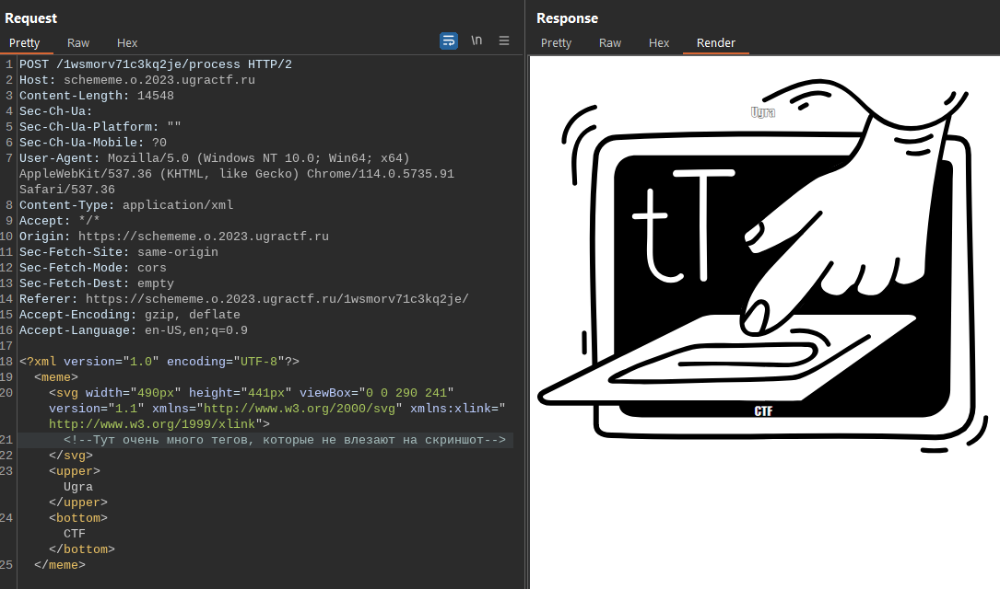
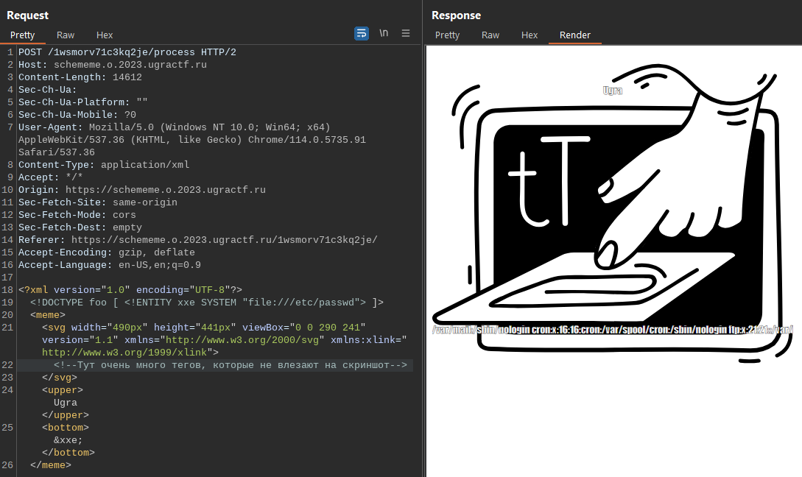
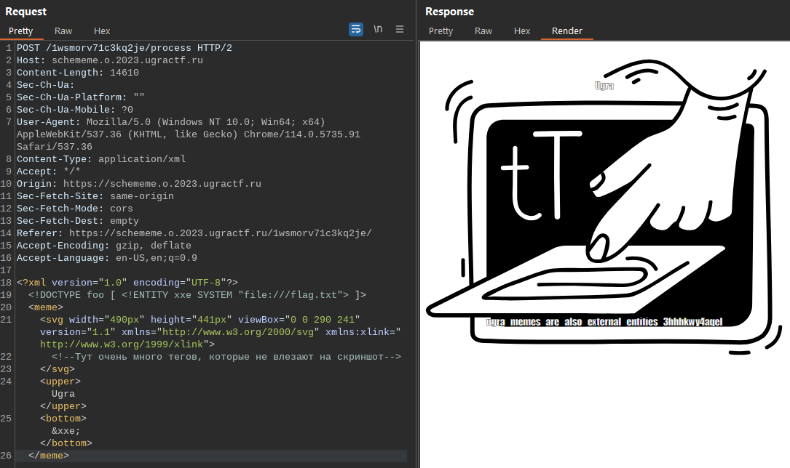

# Схемы и мемы: Write-up

Перейдя на сайт, видим простой генератор мемов. Но почему-то в качестве шаблона он принимает только SVG-картинки. Попробуем сгенерировать мем и посмотреть, что в итоге отправляется на сервер.



Как можно заметить, значения, введённые в форму, собираются в один XML-документ. Родительский элемент документа `<meme>` включает в себя три дочерних элемента:
- `<svg>` — сама картинка;
- `<upper>` — верхний текст;
- `<bottom>` — нижний текст;

Такой неоднозначный подход к формированию запроса к серверу даёт повод задуматься о том, не уязвим ли обработчик XML на сервер к атаке XXE Injection — пожалуй, самой распространённой уязвимости, связанной с обработкой XML-документов.

Ознакомившись с [примерами]((https://portswigger.net/web-security/xxe)) полезных нагрузок, попробуем создать свою, удовлетворяющую формату мема. Пример базового запроса с эксплутацией уязвимости не подойдёт, поскольку на сервере осуществляется проверка соответствия запроса установленному формату (о чём свидетельствует красочное сообщение об ошибке).  

Получился следующий XML-документ:

```
<?xml version="1.0" encoding="UTF-8"?>
<!DOCTYPE foo [ <!ENTITY xxe SYSTEM "file:///etc/passwd"> ]>
    <meme>
        <svg>
            <!--Здесь картинка-->
        </svg>
        <upper>Ugra</upper>
        <bottom>&xxe;</bottom>
    </meme>
```



Ура! Вектор работает и содержимое файла `/etc/passwd` отразилось в нижней подписи мема. Проверим, не лежит ли флаг в одном из самых распространённых мест — в корне.



А вот и флаг! Текст флага можно скопировать либо из текста ответа сервера, либо же прямо из мема в браузере, если подставлять нагрузку путём перехвата HTTP-запроса.

Флаг: **ugra_memes_are_also_external_entities_3hhhkwy4aqel**