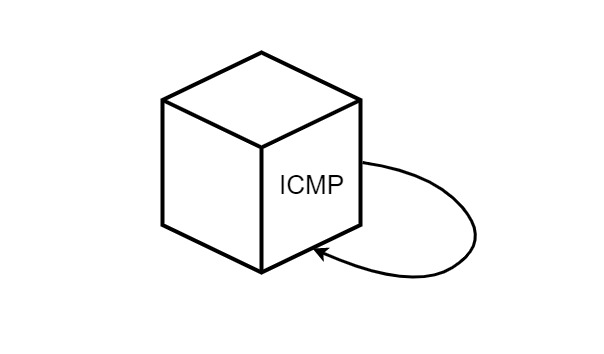
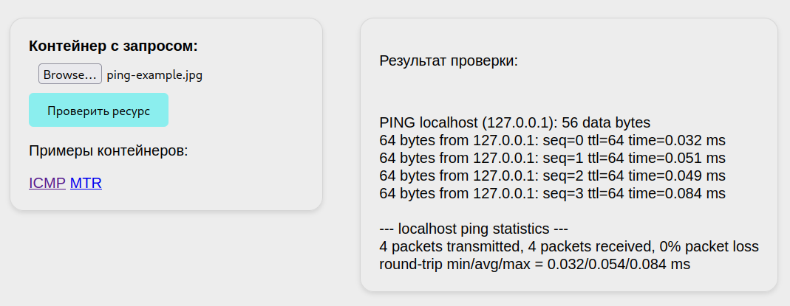
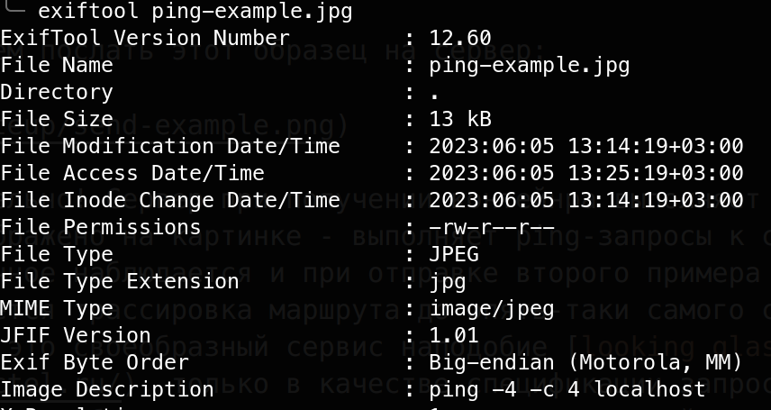
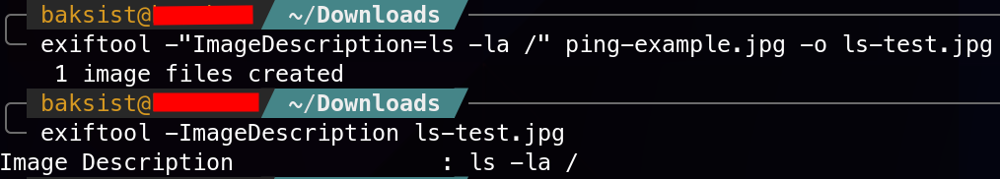
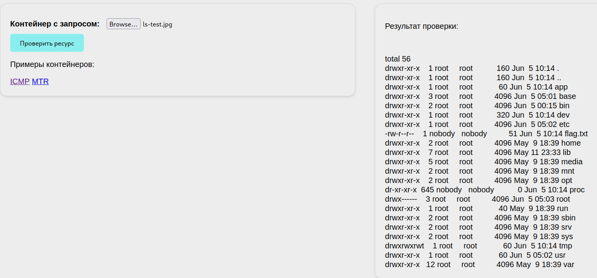
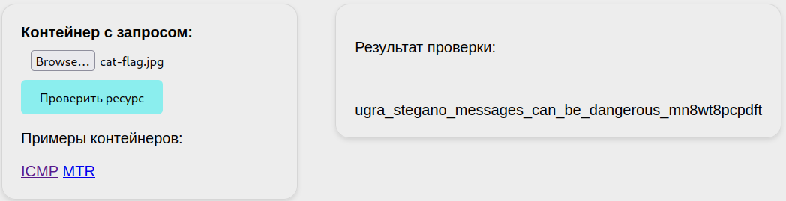

# Стегопентест: Write-up

Нас встречает сервис с названием NeuroGlass, с таинственной формой для «проверки ресурса», которая позволяет загружать картинки. Однако при попытке загрузить обычное изображение, сервер возвращает сообщение об ошибке, в частности о неправильности контейнера. К счастью, разработчиками системы были любезно представлены образцы контейнеров, поддерживающихся системой:

Попробуем послать этот образец на сервер:

Занимательно! Сервер при получении контейнра выполняет ровно то, что изображено на картинке — выполняет ping-запросы к самому себе. Аналогичное наблюдается и при отправке второго примера - выполняется трассировка маршрута до опять-таки самого сервера. Видимо, это своеобразный сервис наподобие [looking glass](https://lg.selectel.ru/), только в качестве спецификации запроса он принимает изображение, из которого посредством нейросетевых технологий распознаются данные о хосте и выполняемой операции.

Но как на самом деле устроен этот контейнер? Учитывая название таска и сомнения в добросовестной работе разработчиков из УНИИИУ, никакими нейросетями тут не пахнет. Взглянем на метаданные примера контейнера с помощью утилиты `exiftool`:

А вот и секрет всей технологии — в теге «ImageDescription» содержится команда, выполняемая на сервере. Проверим, осуществляется ли проверка отправляемой команды, отредактировав тег с помощью той же утилиты. В качестве тестовой команды, например, укажем `ls -la /` — отображение всех файлов в корне файловой системы.

Отправим наш новый контейнер на сервер:

Кажется, проверка содержания контейнеров не осуществляется и на сервере можно выполнить любую команду, а в ответе сервера обнаружился и файлик с флагом. Заменим команду на `cat /flag.txt` и получим наш флажок:

Флаг: **ugra_stegano_messages_can_be_dangerous_mn8wt8pcpdft**