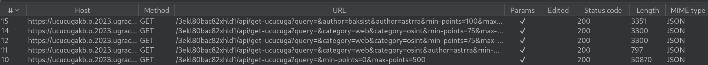
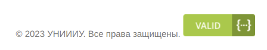
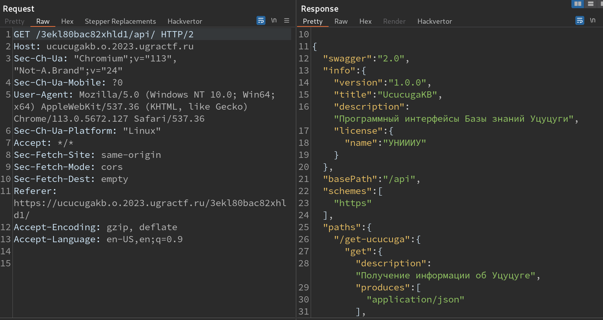
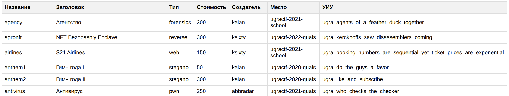
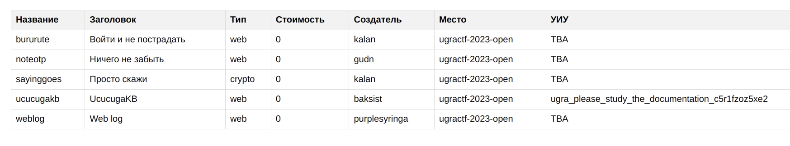

# UcucugaKB: Write-up

Нас встречает сайт с формой, содержащей большое количество полей и фильтров. Ознакомившись с функционалом сайта, становится ясно, что база уцуцуги на самом деле является базой тасков с наших прошлых CTF.

Посмотрим, как именно приложение обращается к базе данных, ознакомившись с историей запросов:



Как можно заметить, приложение обращается к API по маршруту `/api/get-ucucuga`, подставляя значения из формы в виде GET-параметров.

Также в нижней части сайта можно увидеть иконку, подтверждающую валидность схемы используемого API:



А для валидации схемы где-то должна быть и сама схема. Заглянем в корень API:



В ответе содержится схема API в формате JSON, в которой перечисляются все параметры, поддерживаемые приложением. Тут наш интерес привлекает параметр `show-flag`, который прежде не появлялся в запросах, выполненных с фронтенда:

```
{
    "name": "show-flag",
    "description": "логическое значение для включения отображения уникальных идентификаторов Уцуцуги (УИУ)",
    "items": {
        "type": "boolean"
    }
}
```

Добавим этот параметр со значением `true` в запрос, перехватив его с помощью Burp Proxy.



И теперь для каждого таска, возвращённого с сервера, отображается флаг! Но ведь это старые флаги для уже опубликованных задач, а нам нужен новый флаг для текущего таска.

Нам известно, что API поддерживает фильтрацию по CTF, в котором был тот или иной таск. Так как эта задача включена в Ugra CTF 2023 Open, имеет смысл попробовать подставить это название в запрос. Точное название можно получить по аналогии с названиями предыдущих соревнований, которые использовались в запросах или же более внимательно изучить содержание сайта. В коде формы можно обнаружить закоментированную галочку для фильтрации по значению `ugractf-2023-open`.

Ещё раз перехватив запрос к API, изменим его следующим образом:

```
GET /<token>/api/get-ucucuga?show-flag=true&event=ugractf-2023-open
```

Теперь API вернуло флаг для текущего таска, а также отобразило таски, разблокируемые за решение:



Флаг: **ugra_please_study_the_documentation_c5r1fzoz5xe2**
